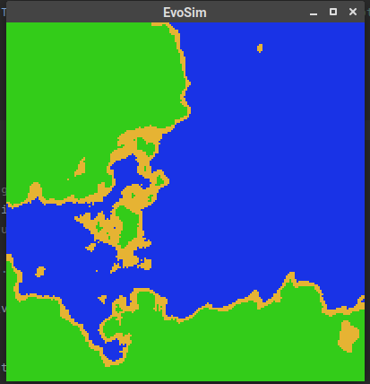

# EvoSim

A (currently very much work in progress) gridworld evolution simulator written in Julia

## Running
Have Julia installed (I used 1.7), cd into EvoSim, and run `julia run_evosim.jl`

## Progress
Currently, the program can generate simple worlds (without any entities). 
Starting the program will (hopefully) yield a Gtk window which shows an overview of a 
    newly generated world every second.

_Example of the current version:_

